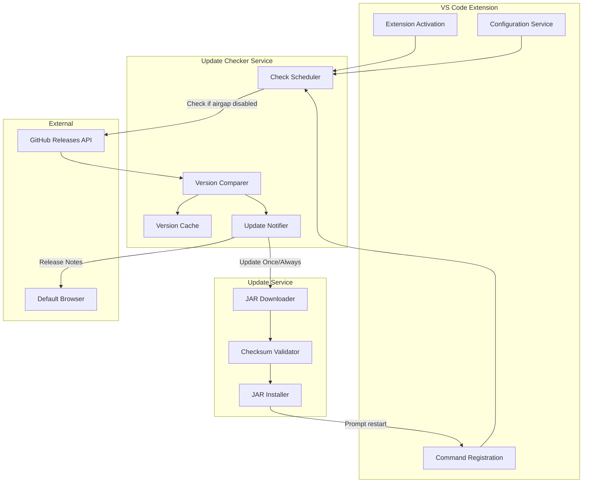
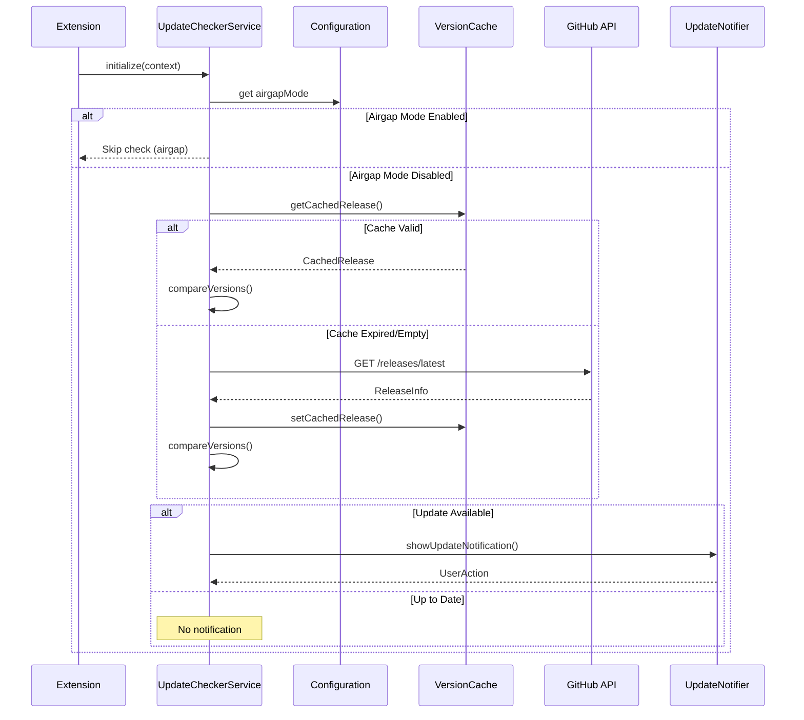
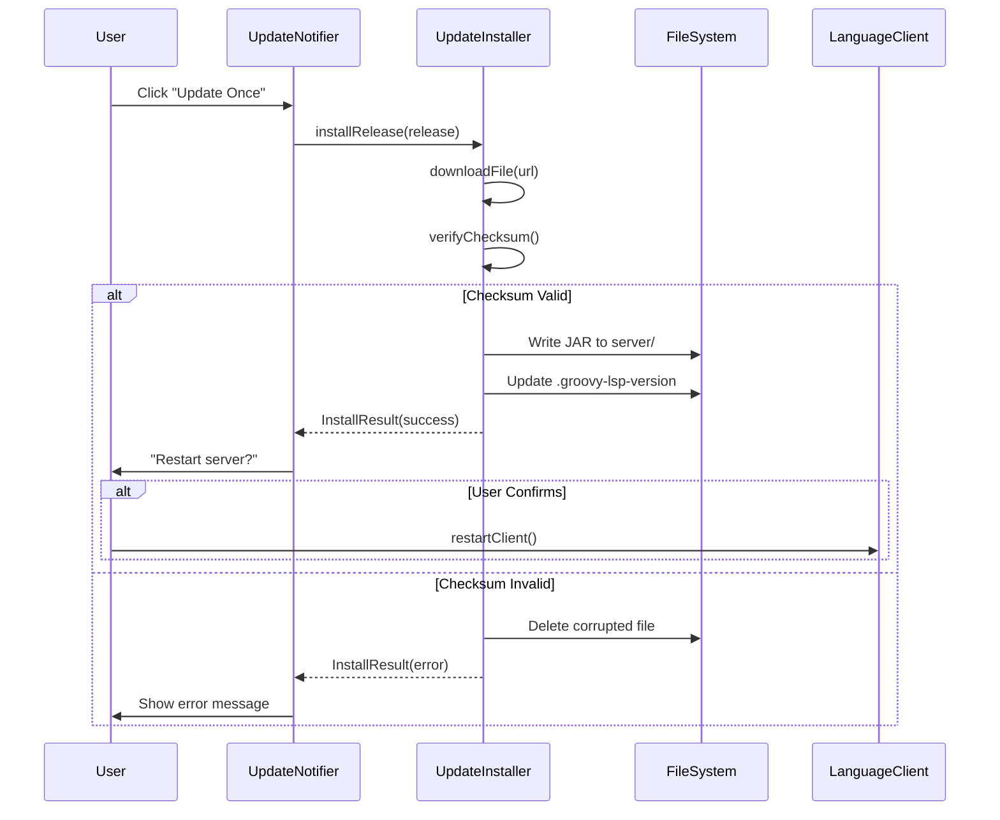

# Design Document: LSP Update Checker

## Overview

The LSP Update Checker is a background service that monitors GitHub releases for newer versions of the Groovy Language Server and provides users with update notifications and one-click installation. The feature integrates seamlessly with the existing extension architecture while respecting user preferences for network isolation (airgap mode) and automatic updates.

The design follows VS Code extension best practices, using the existing configuration system, command registration patterns, and notification APIs. It reuses the download and checksum verification logic from `tools/prepare-server.js` to ensure consistent and secure updates.

## Architecture



## Components and Interfaces

### 1. UpdateCheckerService

The main orchestrator that coordinates version checking, caching, and notifications.

```typescript
interface UpdateCheckerService {
    /**
     * Initializes the update checker with extension context
     */
    initialize(context: ExtensionContext): void;
    
    /**
     * Performs an update check (respects airgap mode and cache)
     * @param force - If true, bypasses cache and airgap mode check
     */
    checkForUpdates(force?: boolean): Promise<UpdateCheckResult>;
    
    /**
     * Disposes resources and cancels pending checks
     */
    dispose(): void;
}

interface UpdateCheckResult {
    status: 'up-to-date' | 'update-available' | 'skipped' | 'error';
    installedVersion: string | null;
    latestVersion: string | null;
    releaseUrl: string | null;
    error?: string;
}
```

### 2. VersionChecker

Handles GitHub API communication and version comparison.

```typescript
interface VersionChecker {
    /**
     * Fetches the latest release info from GitHub
     */
    getLatestRelease(): Promise<ReleaseInfo | null>;
    
    /**
     * Compares two semantic versions
     * @returns positive if a > b, negative if a < b, 0 if equal
     */
    compareVersions(a: string, b: string): number;
    
    /**
     * Checks if a version string is valid for comparison
     */
    isValidVersion(version: string): boolean;
}

interface ReleaseInfo {
    tagName: string;
    version: string;
    releaseUrl: string;
    downloadUrl: string;
    checksum: string | null;
    publishedAt: string;
}
```

### 3. UpdateNotifier

Manages VS Code notifications and user interactions.

```typescript
interface UpdateNotifier {
    /**
     * Shows update available notification with action buttons
     */
    showUpdateNotification(
        currentVersion: string,
        newVersion: string,
        releaseUrl: string
    ): Promise<UpdateAction>;
    
    /**
     * Shows notification that an update was auto-installed
     */
    showAutoUpdateNotification(version: string): Promise<void>;
    
    /**
     * Shows error notification for failed updates
     */
    showErrorNotification(error: string): Promise<void>;
    
    /**
     * Shows "up to date" confirmation
     */
    showUpToDateNotification(version: string): Promise<void>;
}

type UpdateAction = 'always-update' | 'update-once' | 'release-notes' | 'dismissed';
```

### 4. UpdateInstaller

Handles downloading and installing new LSP versions.

```typescript
interface UpdateInstaller {
    /**
     * Downloads and installs a specific release
     */
    installRelease(release: ReleaseInfo): Promise<InstallResult>;
    
    /**
     * Gets the currently installed version
     */
    getInstalledVersion(): string | null;
}

interface InstallResult {
    success: boolean;
    version: string;
    error?: string;
}
```

### 5. VersionCache

Persists check results to avoid excessive API calls.

```typescript
interface VersionCache {
    /**
     * Gets cached release info if still valid
     */
    getCachedRelease(): CachedRelease | null;
    
    /**
     * Stores release info with timestamp
     */
    setCachedRelease(release: ReleaseInfo): void;
    
    /**
     * Clears the cache
     */
    clear(): void;
}

interface CachedRelease {
    release: ReleaseInfo;
    checkedAt: number;
    expiresAt: number;
}
```

## Data Models

### Configuration Schema

New settings added to `package.json`:

```typescript
interface UpdateCheckerConfiguration {
    /**
     * Completely disables all network-based update checking
     * @default false
     */
    'groovy.update.airgapMode': boolean;
    
    /**
     * Automatically install updates without prompting
     * @default false
     */
    'groovy.update.autoUpdate': boolean;
    
    /**
     * Enable update checking on extension activation
     * @default true
     */
    'groovy.update.checkOnStartup': boolean;
    
    /**
     * Hours between automatic update checks (minimum 1)
     * @default 24
     */
    'groovy.update.checkInterval': number;
}
```

### Persisted State

Stored in VS Code's `globalState`:

```typescript
interface UpdateCheckerState {
    /**
     * Last successful check timestamp (ms since epoch)
     */
    lastCheckTime: number;
    
    /**
     * Cached latest release info
     */
    cachedRelease: ReleaseInfo | null;
    
    /**
     * Version that user dismissed (to avoid repeated notifications)
     */
    dismissedVersion: string | null;
}
```

## Error Handling

### Network Errors

- **Timeout**: 30-second timeout for API requests (configured in `VersionChecker.ts` via `request.setTimeout(30000)`); gracefully fail and retry on next check
- **Rate Limiting**: Detect 403/429 responses, extract `X-RateLimit-Reset` header, schedule retry
- **DNS/Connection Failures**: Log warning, continue without update check, don't block activation

### Installation Errors

- **Download Failure**: Show error notification with retry option
- **Checksum Mismatch**: Delete corrupted file, show error, suggest manual download
- **File System Errors**: Show error with path information for troubleshooting

### Version Parsing Errors

- **Invalid Version Format**: Treat as incomparable, skip update suggestion
- **Missing Version File**: Treat as "unknown" version, skip comparison

## Testing Strategy

### Dual Testing Approach

This feature uses both unit tests and property-based tests:

- **Unit tests** verify specific examples, edge cases, and integration points
- **Property-based tests** verify universal properties that should hold across all inputs

### Property-Based Testing

We will use **fast-check** as the property-based testing library for TypeScript/JavaScript.

Each property-based test will:
- Run a minimum of 100 iterations
- Be tagged with a comment referencing the correctness property: `**Feature: lsp-update-checker, Property {number}: {property_text}**`
- Test a single correctness property per test

### Unit Testing

Unit tests will cover:
- Specific version comparison examples (e.g., `v0.1.0` < `v0.2.0`)
- Error handling scenarios (network failures, invalid responses)
- Configuration change handling
- Command execution flows


## Correctness Properties

*A property is a characteristic or behavior that should hold true across all valid executions of a system-essentially, a formal statement about what the system should do. Properties serve as the bridge between human-readable specifications and machine-verifiable correctness guarantees.*

Based on the acceptance criteria analysis, the following correctness properties must be verified through property-based testing:

### Property 1: Semantic version comparison follows semver rules

*For any* two valid semantic version strings `a` and `b`, the `compareVersions(a, b)` function SHALL return:
- A positive number if `a` is newer than `b`
- A negative number if `a` is older than `b`  
- Zero if `a` equals `b`

And the comparison SHALL be transitive: if `a > b` and `b > c`, then `a > c`.

**Validates: Requirements 9.1, 9.3**

### Property 2: Local or unknown versions are never compared

*For any* installed version that is "local", empty, null, or does not match semver format, the update checker SHALL return a result with `status: 'skipped'` and SHALL NOT suggest an update, regardless of the latest available version.

**Validates: Requirements 9.2**

### Property 3: Airgap mode prevents all update network activity

*For any* configuration where `airgapMode` is `true`, calling `checkForUpdates()` SHALL:
- NOT make any HTTP requests to GitHub
- Return a result with `status: 'skipped'`
- NOT trigger any update notifications

**Validates: Requirements 4.1, 4.2**

### Property 4: Auto-update behavior is determined by configuration

*For any* update check that detects a newer version:
- IF `autoUpdate` is `true`, THEN the update SHALL be downloaded and installed automatically
- IF `autoUpdate` is `false`, THEN the update SHALL NOT be installed automatically (only notification shown)

**Validates: Requirements 5.1, 5.3**

### Property 5: Cache prevents redundant checks within interval

*For any* successful update check, subsequent calls to `checkForUpdates()` within the configured `checkInterval` (default 24 hours) SHALL:
- Return the cached result without making new HTTP requests
- Unless `force: true` is passed, which bypasses the cache

**Validates: Requirements 7.1**

## Sequence Diagrams

### Startup Update Check Flow



### Update Installation Flow



## File Structure

```
client/src/
├── features/
│   └── update/
│       ├── index.ts                 # Public exports
│       ├── UpdateCheckerService.ts  # Main orchestrator
│       ├── VersionChecker.ts        # GitHub API + version comparison
│       ├── UpdateNotifier.ts        # VS Code notifications
│       ├── UpdateInstaller.ts       # Download and install logic
│       └── VersionCache.ts          # Persistence layer
├── configuration/
│   └── settings.ts                  # Extended with update settings
└── commands/
    └── index.ts                     # Extended with update commands

client/test/unit/features/update/
├── UpdateCheckerService.test.ts
├── VersionChecker.test.ts
├── VersionChecker.property.test.ts  # Property-based tests
├── UpdateNotifier.test.ts
├── UpdateInstaller.test.ts
└── VersionCache.test.ts
```

## Configuration Changes

### New Settings in package.json

```json
{
  "groovy.update.airgapMode": {
    "type": "boolean",
    "default": false,
    "description": "Completely disable all network-based update checking. Enable this for air-gapped or restricted network environments."
  },
  "groovy.update.autoUpdate": {
    "type": "boolean",
    "default": false,
    "description": "Automatically download and install Groovy LSP updates without prompting."
  },
  "groovy.update.checkOnStartup": {
    "type": "boolean",
    "default": true,
    "description": "Check for Groovy LSP updates when the extension activates."
  },
  "groovy.update.checkInterval": {
    "type": "number",
    "default": 24,
    "minimum": 1,
    "description": "Hours between automatic update checks (minimum 1 hour)."
  }
}
```

### New Commands

```json
{
  "command": "groovy.update.check",
  "title": "Groovy: Check for LSP Updates"
}
```

## Dependencies

- **fast-check**: Property-based testing library (dev dependency)
- No new runtime dependencies - uses Node.js built-in `https` module for API calls

## Security Considerations

1. **Checksum Verification**: All downloaded JARs are verified against checksums from `checksums.txt` in the release
2. **HTTPS Only**: All GitHub API calls use HTTPS
3. **No Credential Storage**: GitHub token (if used) comes from environment variable only
4. **Airgap Mode**: Provides complete network isolation for sensitive environments
